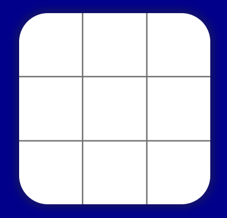
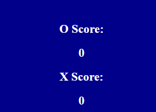
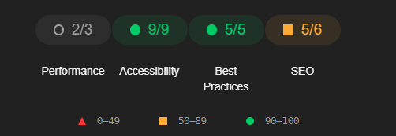

# Tic Tac Toe. 

## UX  
### Website Owner Goals 
Provide users with the ability to play Tic Tac Toe.
#### User Goals 
To play Tic Tac Toe
## Structure of the website 
A very simple structure with the game board at the center of the page, a tite at the top and a scoreboard at the bottom. Scales great on any device. Users get interaction through the pointer changing, sound when placing markers on the board, and a hover effect when pressing the reset button. 
### Wireframes 

# Surface 
## Colors 
The main color is dark blue. A nice color is easy on the eyes. Orange is the other color used as it works well with blue. 
##### Fonts 
No special fonts were used.
### Images 
Draw all the images used on FireAlpaca, a simple grid, a O and an X. 
# Features 
### Game Board 
The board is visible in the center of the page. Clicking in any of the 9 squares will place a marker of the coresping player's turn. When any of the requirements for a win are met, no more markers can be placed, a winner is announced and a nice fanfare plays. 

#### Score Board 
When a player wins the score is incremented by one. 

#### Reset Game Button
Once pressed the game will reset. 

# Technologies used 
## HTML5 
HTML5 is used for the main structure of the website. The board cells are made in HTML and use an event listener to detect where the user clicked. 
## CSS3 
CSS is used to arrange the elements on the page and to render the images. Used as a style language. 
## JavaScript
JavaScript is used for the logic of the game. 
## Game/Code Logic
An array of arrays is declared, it mimics the grid of cells. The 2 players are represented by a -1 and a 1. The player variable is declared as 1. When one of the cells is clicked the according array is edited by changing one of its 0 to the value of the player constant, either 1 or -1. A class for the div in HTML of either cross or circle is applied. Then the player is changed by multiplying the player number by -1, this will turn a 1 in a -1 and a -1 into a 1. The turn checker is also updated with the appropriate player's marker. A win is calculated when the sum of an array reaches either 3 or -3. When a win condition is reached users cannot click on the board any more. If the reset button is pressed all the markers  will be removed and the board becomes clickable again.
## Replit
Used to developt and deploy live website.
## Testing
### Performance testing
I run the Lighthouse tool to check the performance of the website.

### Compatibility testing
Site was tested across multiple virtual mobile devices and browsers. I checked all supported devices in both Mozilla web developer tools and Chrome developer tools.
## HTML 
W3C finds some errors, but they are not causing any issues with the functionality of the website. 
## CSS
W3C did not find any errors.
## JavaScript
Metrics
There are 11 functions in this file.
Function with the largest signature take 2 arguments, while the median is 0.
Largest function has 25 statements in it, while the median is 5.
The most complex function has a cyclomatic complexity value of 13 while the median is 1.
# Future implementations
Online multiplayer. 